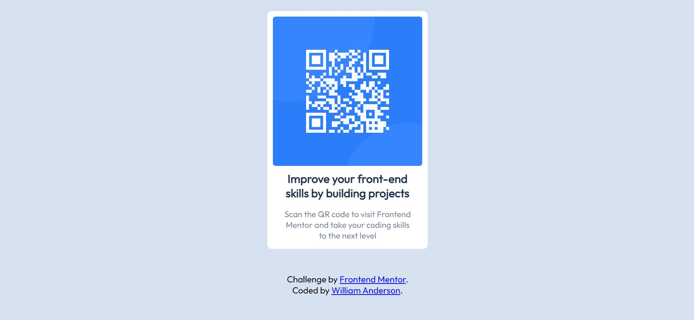

# Frontend Mentor - QR code component solution

This is a solution to the [QR code component challenge on Frontend Mentor](https://www.frontendmentor.io/challenges/qr-code-component-iux_sIO_H). Frontend Mentor challenges help you improve your coding skills by building realistic projects. 

## Table of contents

- [Overview](#overview)
  - [Screenshot](#screenshot)
  - [Links](#links)
- [My process](#my-process)
  - [Built with](#built-with)
  - [What I learned](#what-i-learned)
  - [Continued development](#continued-development)
  - [Useful resources](#useful-resources)

**Note: Delete this note and update the table of contents based on what sections you keep.**

## Overview

I am just beginning to learn how to write HTML, CSS, and JS code. I am a physics and astronomy teacher, and my first project was to build a constellation bingo app. I fumbled my way throught that project, but now want to improve my code writing skills. So, I am taking on Frontend Montor projects to challenge me to improve my skills and to highlight areas of weakness and lack of knowledge.

### Screenshot

### Links

- Solution: [GitHub repository](https://github.com/wbandersonjr/Solution-QR_Code_Component-Frontend_Mentor-Using_Flexbox.git)
- Live Site: [Site hosted on Netlify](https://qr-code-component-wbandersonjr.netlify.app/)

## My process

I first thought about the layout and came up with an itea of what containers and elements I needed. I thought about which containers would need to nest inside which parent containers, and which items I would need to style individually, versus those that would style similarly. Then, I wrote my HTML and classes with the previous ideas in mind. Finally, I wrote the CSS styling to get the layout, colors, and text correct.

### Built with

- HTML5
- CSS
- Flexbox

### What I learned

The major thing I learned from this project is how to start using Flexbox to control the layout of my containers and elements.

The solution feedback from Frontend Mentor informed me of the accesibilty practices of using landmarks. I also neglected to include alt text for the QR code image.

Feedback from [Abdul Khalid](https://www.frontendmentor.io/profile/0xAbdulKhalid) was very helpful in understanding the difference between `min-height` and `height` properties. I had set my `<body>` element to `height: 100vh`, and Abdul explained that any content which extended beyond the viewport would be cut off. So, he recommended the practice of using `min-height: 100vh` to ensure that the `<body>` element will grow with the content, if desired.

### Continued development

I need to continue completing challenges with various layouts to futher develop my skills with Flexbox. 

I am also so new to HTML and CSS that my code is probably sloppy and more complex than necessary. I am also unfamiliar with many of the CSS properties that are needed for completing various projects. So, with more practice I will become more familiar with the most useful properties and not need to search the web for help as frequently.

### Useful resources

- [Flexbox tutorial](https://www.youtube.com/watch?v=siKKg8Y_tQY) - This video, by Max from Academind, was very helpful with learning the basics of Flexbox and its layout properties. 
- [Text containers and Flexbox](https://dev.to/afif/never-make-your-text-container-a-flexbox-container-m9p) - This answer was helpful, because I made exactly this mistake in my original code.

